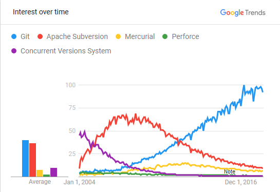
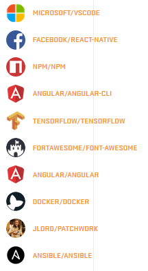

# HowToGitGit
## A repo for my presentation on git for DSU Computer Club

### Aim to answer/accomplish these questions/tasks.
- [ ] What is git?
- [ ] Why use git?
- [ ] What is GitHub?
- [ ] Let's make a repo
- [ ] Let's clone that repo
- [ ] Let's add some files and make a commit
- [ ] Let's show how I can pull those changes on another computer
- [ ] Let's do it another way by making a branch and commiting to that
- [ ] Let's merge that branch back to master
- [ ] Let's review

## What is git?

&nbsp;&nbsp;&nbsp;&nbsp;&nbsp;&nbsp;  Git is a source control system that allows for historical snapshotting of files and sharing of those files amongst one or more people. Basically it's Google Drive with the ability to snapshot your file changes (but with so, so much more). This allows you to better keep track of changes in a filebase, give yourself access to your files from any machine with access to the internet, and the ability to implement new features to a repository without stepping on your fellow collaborator's toes. Also, Git was created by Linus Torvalds in 2005 for development of the Linux kernel, so there is your ethos appeal.

- [X] What is git?

## Why use git?

&nbsp;&nbsp;&nbsp;&nbsp;&nbsp;&nbsp;  It will make your life as a developer (or just user of files) easier. Sure you have to learn some stuff, but once you do, you will have the ability to control your codebase in a centralized, backed up, and efficent way. On top of that, knowledge of git increases your employability. Every real world developer position you will find will utilize some form of source control. If they don't, I would encourage you to seek opportunities elsewhere. Haven't convinced you yet? GIT IS FREE! and there are tons of free git hosting services.

&nbsp;&nbsp;&nbsp;&nbsp;&nbsp;&nbsp; While git is awesome, it isn't the only Version Control System out there. Some other ones include Apache Subversion (SVN) and Mercurial, or Microsoft's Team Foundation Version Control. I don't know much about these, but as far as popularity via Google search goes, Git reigns supreme.

- [X] Why use git?

## What is GitHub?

&nbsp;&nbsp;&nbsp;&nbsp;&nbsp;&nbsp; Well now that we have an idea of what Git is, we need to talk about git hosting platforms. Git hosting platforms are what make Git as a technology available on the web. Without some sort of centralized server/hosting platform, Git would only give you the ability to snapshot and divide your filebase locally. All of the sharing capabilities and bells and whistles come from a hosting platform. Github is among the most popular of these platforms. Github currently hosts more than 28 million users, more than 85 million repositories, and is home to many prestigious open source projects. 

- [X] What is GitHub?

I learned how to make this readme [here](https://help.github.com/articles/basic-writing-and-formatting-syntax/#links).
